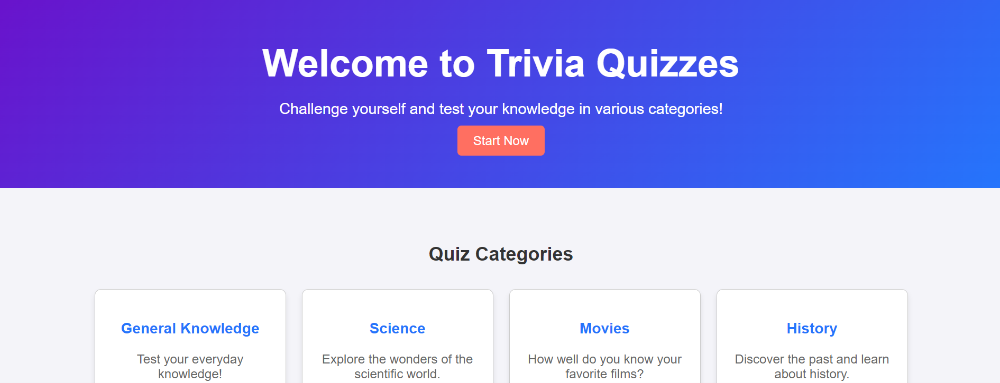
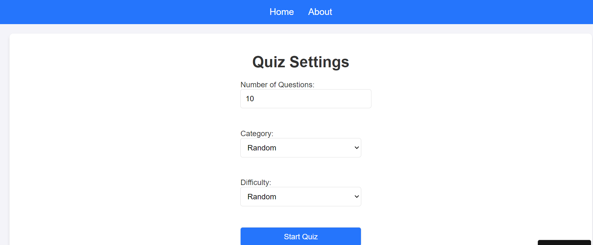
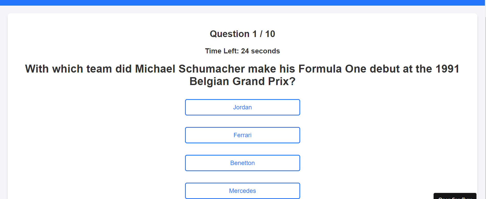
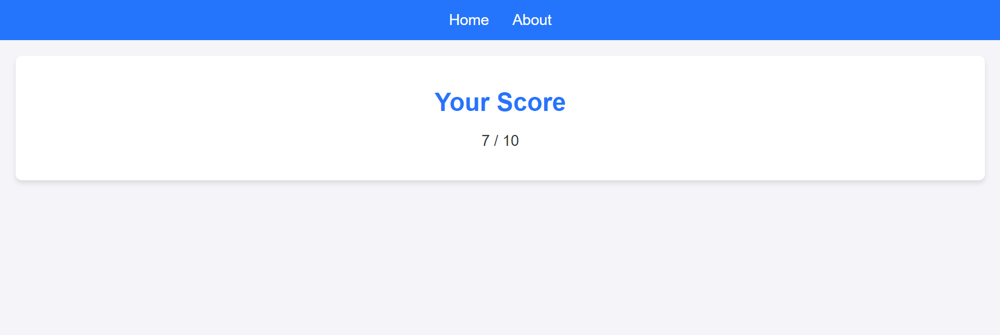

# Trivia Quiz Application 

Welcome to the **Quizzes Trivia Application**! This is a React-based trivia application where users can answer fun trivia questions, test their knowledge, and see their results. The project demonstrates an adaptive and responsive web application built with React.

ChatGPT-4o was used alongside the slides to expand our knowledge of certain topics, and improve the code. We also used it to help resolve bugs we came across during development. Many issues were addressed successfully.
ChatGPT-4o was also utilized as a helpful resource to assist in creating basic CSS styling for this project.
---

## Features

- Dynamic quiz questions with multiple-choice answers.
- Categories and Customization
- Scoring system that calculates and displays results.
- Responsive design for mobile and desktop devices.

---

## Getting Started

You can access the app directly via the following link to github pages:

👉 [Trivia Quiz](https://mohund.github.io/final-project-quizwebsite)

Simply click the link and start enjoying the quiz!

## Screenshots 

### Home Page

### Settings

### Quiz in Progress

### Results Page

